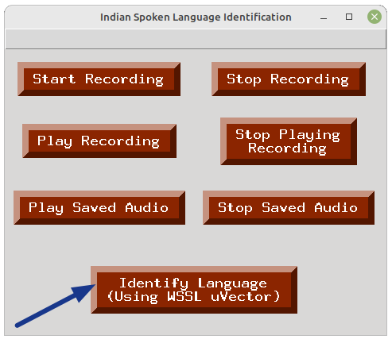
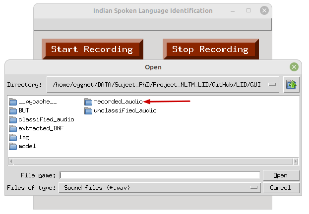

# Spoken Language Identification using u-vector with GUI

This Python script implements a graphical user interface (GUI) for Spoken Language Identification using u-vector with WSSL model. The GUI allows users to perform various tasks such as recording audio, playing saved audio files, and identifying the language of spoken audio using u-vector with WSSL models.

## Prerequisites

#### Platform
- Operating System: Ubuntu 22.04
- Python: python >= 3.8 (make sure the default python is python3)

#### Make sure you have the following libraries installed:

- pandas
- sounddevice
- soundfile
- pygame
- torch
- matplotlib
- numexpr
- scipy
- numpy

#### The list of imported libraries

- tkinter
- pygame
- matplotlib
- datetime
- shutil
- random
- os
- scipy
- numpy

#### You can install these libraries using the following command:

```bash
pip install pandas sounddevice soundfile pygame torch matplotlib numexpr numpy scipy
```
Or,

```bash
pip install -r requirements.txt
```

## Usage

#### 1. Clone the repository:

```bash
git clone https://github.com/NLTM-LID/LID.git
cd LID/GUI
```

#### 2. Make sure the following directories and Python files are present.
- BUT: It contains the codes and pretrained model used for extracting the bottleneck features (BNF).
- classified_audio: It keeps the correctly classified audio files based on the user feedback.
- unclassified_audio: It keeps the wrongly classified audio files based on the user feedback.
- recorded_audio: It stores the current recorded audio.
- extracted_BNF: Stores the extracted bottleneck features (BNF) of the audio file.
- model: Contains the pretrained model.
- demo_uvector_wssl.py: Code for the u-vector with WSSL
- extract.py: Calling the python script to extract the BNF features
- sound.py: Contains the code for audio recording features.
- gui.py: It's the main code for GUI.

#### 3. Run the script:

```bash
python gui.py
```

The GUI window will appear, providing options for recording audio, playing saved audio, and identifying the language using u-vector with WSSL models.

## Features

#### 1. Recording the speech audio

##### (i) Start Recording
 First click on the "Start Recording" button and then press the "OK" button to start the recording of speech audio using the microphone.

<p float="left">
  
  
</p>

##### (ii) Stop Recording
To stop the ongoing audio recording, click on the "Stop Recording" button. The recording will be stopped immediately. Then click on the "OK" button. After this, the next window will show the message regarding the location of saved recorded audio. You need to choose this audio when you will perform the language identification.
<p float="left">
  
  
  
</p>

##### (iii) Play Recording
If you want to liesten the recorded audio, you can do it by pressing the "Play Recording" button.
<p float="left">
  
</p>

##### (iii) Stop Playing Recording
If you want to stop playing the recorded audio in between, you can do it by pressing the "Stop Playing Recording" button.
<p float="left">
  
</p>

#### 2. To check the saved speech audio
You can check the saved audio by playing the saved audio. Click on the "Play Saved Audio" button and then choose the audio file using opened file manager. After selecting the audio file, the audio will be played. You can also stop playing the audio any time by clicking the "Stop Saved Audio" button.

<p float="left">
  
  
  
</p>

#### 3. Language Identification: 

We have u-vector with WSSL model to perform the language identification task. We need to click "Identify Language (Using WSSL uVector)" to perform the language identification.
<p float="left">
  
</p>

After clicking it, we need to select an audio file. We can select the recorded audio from the "recorded_audio" directory. We can also choose another saved audio file using the open file manager.
<p float="left">
  
</p>

After selecting the audio file, the predicted language will show on the message window. This window will also ask the user for the feedback that predicted language is correct or not. Based on the user feedback, this audio file will be copied to "classified_audio" or "unclassified_audio" directory if prediction is correct or wrong, respectively.
<p float="left">
  
</p>

Later, a bar graph will display the predicted probabilities of all languages.
<p float="left">
  
</p>

## Results and Confirmation

- After language identification, the predicted language is displayed, and a confirmation message box appears. The user can confirm or deny the predicted language.
- If confirmed, the audio file is copied to the corresponding language directory under the `classified_audio` directory with filename containing current timestamp.
- If denied, the audio file is also copied to the `unclassified_audio` directory with filename containing current timestamp.

## Additional Information

- The GUI uses pygame for audio playback and matplotlib for displaying language identification probabilities.
- The u-vector with WSSL model is loaded from the `demo_uvector_wssl` modules.
- The `sound` module handles audio recording functionalities.

## References

- H. Muralikrishna, S. Pulkit, J. Anuksha, and A. D. Dileep, "Spoken Language Identification using Bidirectional LSTM based LID Sequential Senones." in IEEE Automatic Speech Recognition and Understanding Workshop (ASRU), Sentosa, Singapore, 2019, pp. 320-326. (https://ieeexplore.ieee.org/document/9003947)
- H. Muralikrishna, S. Kapoor, A. D. Dileep, and P. Rajan, "Spoken Language Identification in unseen Target Domain using Within-sample Similarity Loss." in IEEE International Conference on Acoustics, Speech and Signal Processing (ICASSP), Toronto, Canada, 2021, pp. 7223-7227. (https://ieeexplore.ieee.org/document/9414090)

## License

This project is licensed under the NLTM License - see the [LICENSE](../LICENSE) file for details.
