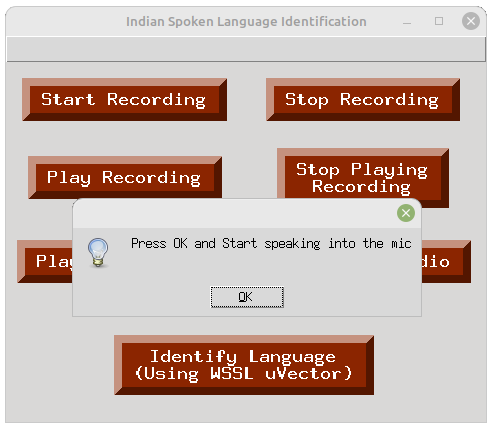
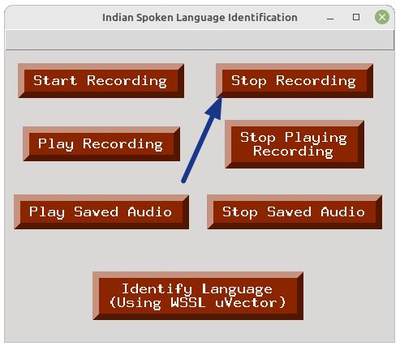
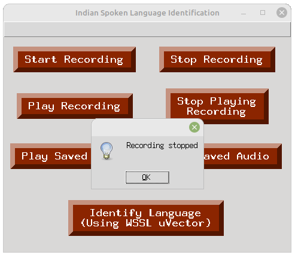
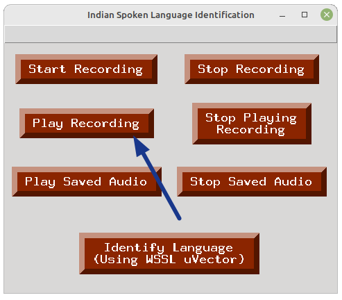
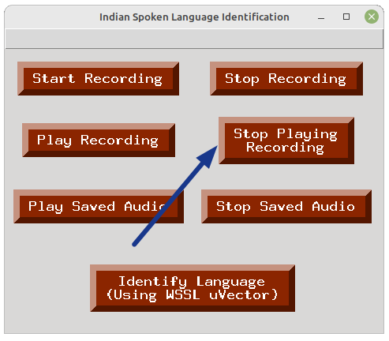
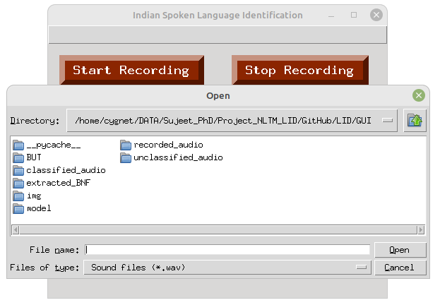
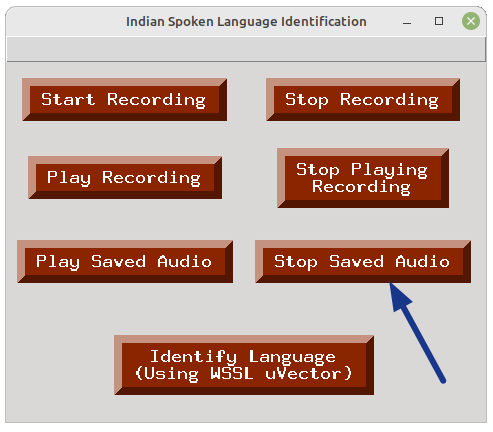

# Spoken Language Identification GUI

This Python script implements a graphical user interface (GUI) for Spoken Language Identification using u-vector and u-vector with WSSL models. The GUI allows users to perform various tasks such as recording audio, playing saved audio files, and identifying the language of spoken audio using both standard u-vector and WSSL u-vector models.

## Prerequisites

#### Platform
- Operating System: Ubuntu 22.04
- Python: python >= 3.8 (make sure the default python is python3)

#### Make sure you have the following libraries installed:

- pandas
- sounddevice
- soundfile
- pygame
- torch
- matplotlib
- numexpr

#### The list of imported libraries

- tkinter
- pygame
- matplotlib
- datetime
- shutil
- random
- os

#### You can install these libraries using the following command:

```bash
pip install pandas sounddevice soundfile pygame torch matplotlib numexpr
```
Or,

```bash
pip install -r requirements.txt
```

## Usage

#### 1. Clone the repository:

```bash
git clone https://github.com/NLTM-LID/LID.git
cd LID/GUI
```

#### 2. Make sure the following directories and Python files are present.
- BUT: It contains the codes and pretrained model used for extracting the bottleneck features (BNF).
- classified_audio: It keeps the correctly classified audio files based on the user feedback.
- unclassified_audio: It keeps the wrongly classified audio files based on the user feedback.
- recorded_audio: It stores the current recorded audio.
- extracted_BNF: Stores the extracted bottleneck features (BNF) of the audio file.
- model: Contains the pretrained models.
- demo_uvector.py: Code for the u-vector
- demo_uvector_wssl.py: Code for the u-vector with WSSL
- extract.py: Calling the python script to extract the BNF features
- sound.py: Contains the code for audio recording features.
- gui.py: It's the main code for GUI.

#### 3. Run the script:

```bash
python gui.py
```

The GUI window will appear, providing options for recording audio, playing saved audio, and identifying the language using u-vector and u-vector with WSSL models.

## Features

#### 1. Recording the speech audio

##### (i) Start Recording
 First click on the "Start Recording" button and then press the "OK" button to start the recording of speech audio using the microphone.

<p float="left">
  
  
</p>

##### (ii) Stop Recording
To stop the ongoing audio recording, click on the "Stop Recording" button. The recording will be stopped immediately. Then click on the "OK" button. After this, the next window will show the message regarding the location of saved recorded audio. You need to choose this audio when you will perform the language identification.
<p float="left">
  
  
  
</p>

##### (iii) Play Recording
If you want to liesten the recorded audio, you can do it by pressing the "Play Recording" button.
<p float="left">
  
</p>

#### 2. To check the saved speech audio
You can check the saved audio by playing the saved audio. Click on the "Play Saved Audio" button and then choose the audio file using opened file manager. After selecting the audio file, the audio will be played. You can also stop playing the audio any time by clicking the "Stop Saved Audio" button.

<p float="left">
  
  
  
</p>

#### 3. Language Identification: 
We have two models (u-vector and u-vector with WSSL) to perform this task. We need to click "Identify Language (Using uVector)" for u-vector and "Identify Language (Using WSSL uVector)" for u-vector with WSSL.
<p float="left">
  
  
</p>

After clicking anyone of the option, we need to select an audio file. We can select the recorded audio from "recorded_audio" directory. We can also choose other saved audio file using the open file manager.
 <p float="left">
  
</p>


## Results and Confirmation

- After language identification, the predicted language is displayed, and a confirmation message box appears. The user can confirm or deny the predicted language.
- If confirmed, the audio file is moved to the corresponding language directory under `classified_audio` directory with a timestamped filename.
- If denied, the audio file is also moved to the `unclassified_audio` directory with a different timestamped filename.

## Additional Information

- The GUI uses pygame for audio playback and matplotlib for displaying language identification probabilities.
- The u-vector and u-vector with WSSL models are loaded from the `demo_uvector` and `demo_uvector_wssl` modules.
- The `sound` module handles audio recording functionalities.

## References

- H. Muralikrishna, P. Sapra, A. Jain and D. A. Dinesh, "Spoken Language Identification Using Bidirectional LSTM Based LID Sequential Senones," 2019 IEEE Automatic Speech Recognition and Understanding Workshop (ASRU), Singapore, 2019, pp. 320-326, doi: 10.1109/ASRU46091.2019.9003947.(https://ieeexplore.ieee.org/document/9003947)
- M. H, S. Kapoor, D. A. Dinesh and P. Rajan, "Spoken Language Identification in Unseen Target Domain Using Within-Sample Similarity Loss," ICASSP 2021 - 2021 IEEE International Conference on Acoustics, Speech and Signal Processing (ICASSP), Toronto, ON, Canada, 2021, pp. 7223-7227, doi: 10.1109/ICASSP39728.2021.9414090.(https://ieeexplore.ieee.org/document/9414090)

## License

This project is licensed under the NLTM License - see the [LICENSE](../LICENSE) file for details.
